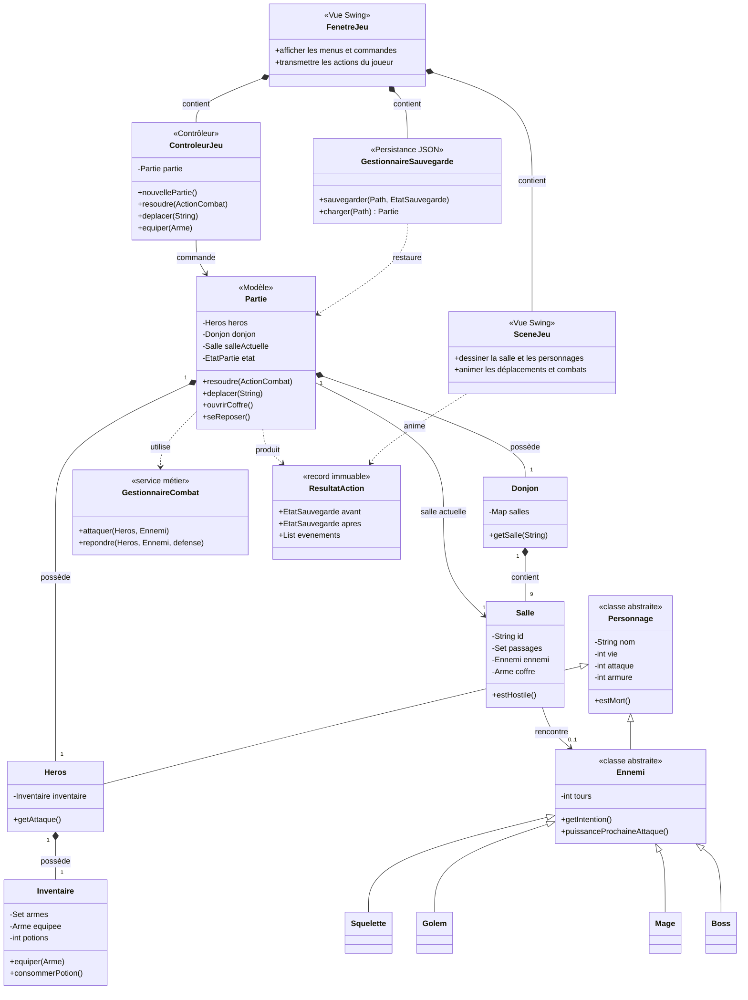
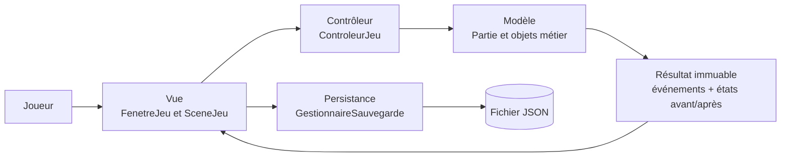
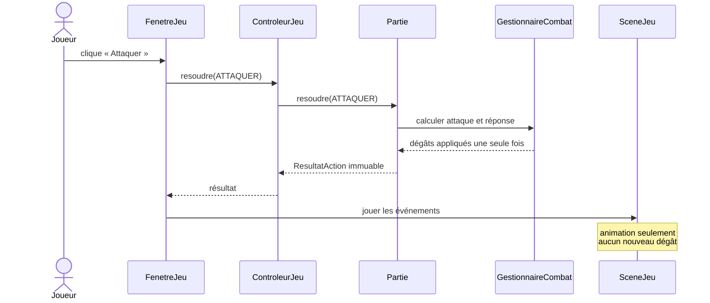

# Schéma de conception POO — Les Salles oubliées

Ce document présente la conception générale du jeu sous une forme volontairement simple. Les attributs et méthodes secondaires sont omis afin de faire apparaître les responsabilités et les relations entre objets.

## Diagramme principal

## Comment lire le schéma

| Symbole | Signification | Exemple dans le projet |
| --- | --- | --- |
| `*--` | Composition : l'objet fait partie d'un autre | Une `Partie` possède un `Heros` et un `Donjon`. |
| `<|--` | Héritage : une classe spécialisée hérite d'une classe générale | `Heros` et `Ennemi` héritent de `Personnage`. |
| `-->` | Association : un objet connaît ou commande un autre objet | Le contrôleur commande la `Partie`. |
| `..>` | Dépendance : une classe utilise ponctuellement une autre | `Partie` utilise `GestionnaireCombat`. |
| `1`, `9`, `0..1` | Cardinalités | Un donjon contient exactement neuf salles ; une salle a zéro ou un ennemi. |

## Répartition des responsabilités

- **Vue** : affiche le donjon, reçoit les clics et anime les résultats. Elle ne calcule pas les dégâts.
- **Contrôleur** : fait le lien entre l'interface et la partie courante.
- **Modèle** : contient toutes les règles, les personnages, les salles, le combat et les invariants.
- **Persistance** : transforme un instantané validé en JSON et reconstruit une partie valide.

## Exemple : une attaque

L'idée importante est que le modèle résout le tour **une seule fois**. La scène lit ensuite les événements pour montrer l'attaque, les dégâts et la réponse ennemie sans rappeler les méthodes métier.

## Points POO à présenter à la prof

1. **Encapsulation** : les attributs sont privés et les collections exposées ne sont pas modifiables directement.
2. **Héritage** : `Personnage` factorise la vie, l'attaque et l'armure ; `Ennemi` ajoute le comportement commun des adversaires.
3. **Polymorphisme** : squelette, golem, mage et boss répondent différemment grâce aux méthodes redéfinies de `Ennemi`.
4. **Composition** : une partie est composée d'un héros et d'un donjon ; le donjon est composé de neuf salles.
5. **Séparation des responsabilités** : le modèle ne dépend ni de Swing ni de Jackson. La vue affiche, le contrôleur coordonne et la persistance gère le JSON.
6. **Immutabilité** : `ResultatAction`, `EvenementJeu` et les instantanés de sauvegarde sont des records protégés contre les modifications accidentelles.

Pour une étude exhaustive avec tous les attributs, les records de sauvegarde et les classes de rendu, consulter [UML.md](UML.md).
