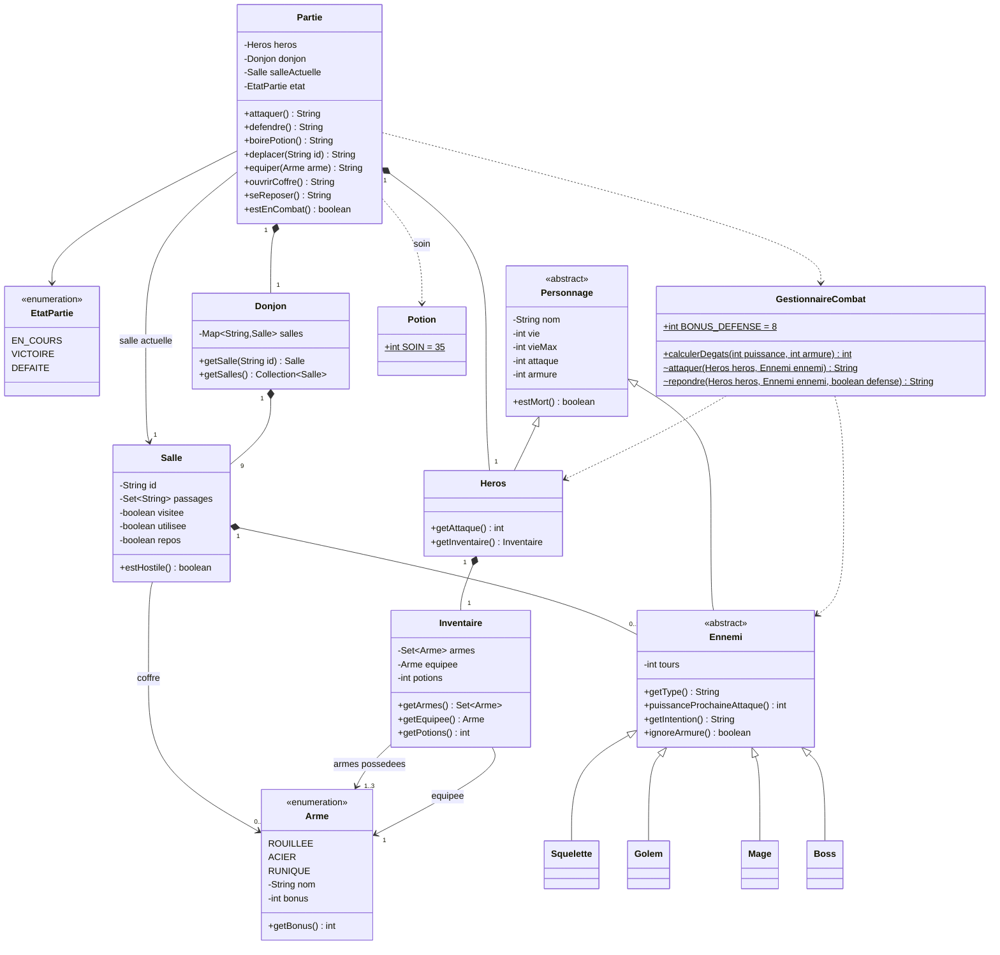
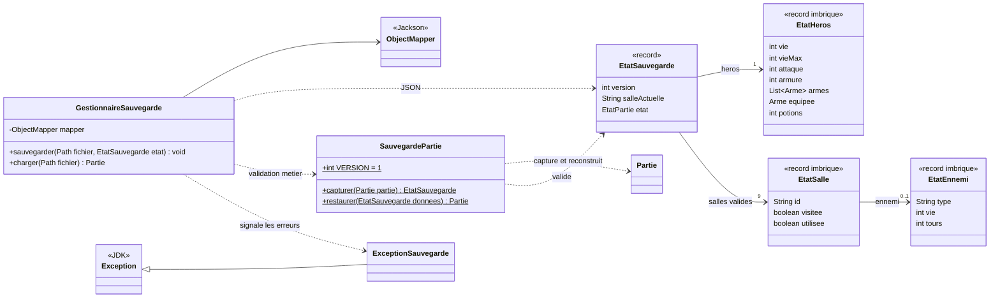
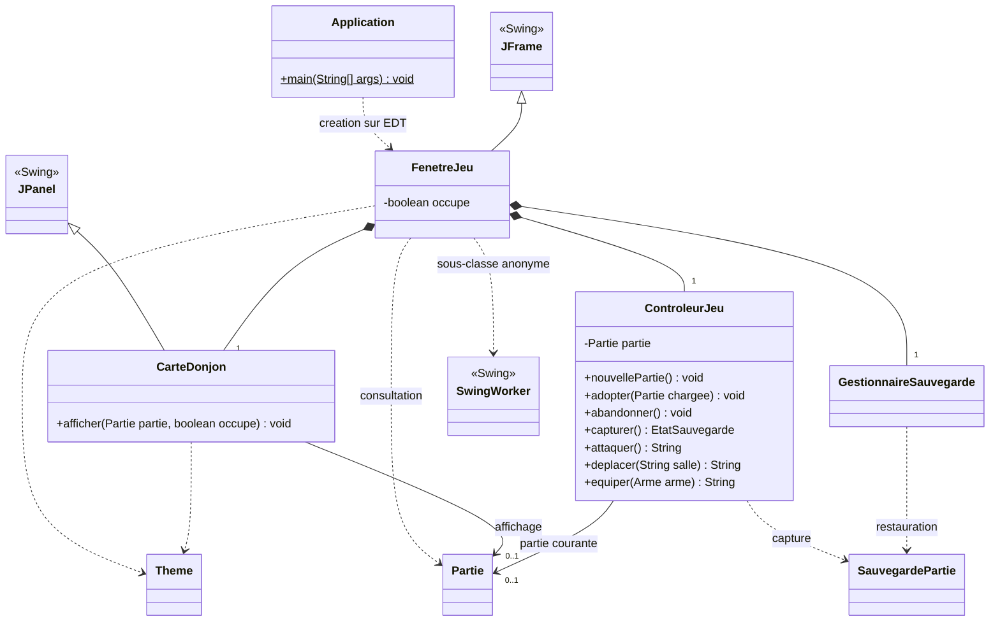

# Diagrammes de classes

Ces diagrammes décrivent les classes du code Java. Pour rester lisibles, ils séparent le modèle de jeu, les données de sauvegarde et l'intégration Swing ; les classes répétées désignent les mêmes types. Les accesseurs et méthodes privées secondaires sont omis. `+` désigne une opération publique, `-` un attribut privé, `<|--` l'héritage, `*--` la composition et `..>` une dépendance d'utilisation.

## Modèle de jeu

Toutes ces classes appartiennent à `fr.utbm.sallesoubliees.modele`.

Les passages sont stockés comme identifiants de salles (`Set<String>`), pas comme une seconde collection d'objets `Salle`. La salle actuelle référence une salle du donjon. Les valeurs d'`Arme` sont partagées et immuables : ce sont des associations, pas des objets créés et détruits avec l'inventaire.

`Potion` contient uniquement la constante de soin ; les potions restantes sont un nombre dans `Inventaire`. Aucune classe `Objet` n'existe : les besoins actuels ne justifient pas une hiérarchie d'objets générique. Les classes utilitaires `Potion` et `GestionnaireCombat` ont un constructeur privé. Dans le diagramme, `$` indique un membre statique et `~` une méthode accessible uniquement dans le package.

## Instantané et persistance

`EtatSauvegarde` et `SauvegardePartie` sont dans `modele`. Les trois records `EtatHeros`, `EtatSalle` et `EtatEnnemi` sont déclarés à l'intérieur d'`EtatSauvegarde`. Seuls `GestionnaireSauvegarde` et `ExceptionSauvegarde` appartiennent à `persistance`.

Les cardinalités décrivent les instantanés valides. Les valeurs d'un record sont exposées par ses accesseurs générés, tandis que les champs Java restent privés et finaux. Les listes sont copiées défensivement ; l'instantané est indépendant de la partie vivante. La validation des relations incombe à `SauvegardePartie.restaurer`, et non aux seuls constructeurs de records. Le modèle peut donc capturer et restaurer un état sans connaître JSON ou Jackson.

## Application, contrôle et Swing

`Application` est dans le package racine ; les classes de présentation sont dans `vue`, `ControleurJeu` dans `controleur`. Le contrôleur conserve zéro partie à l'accueil, puis la partie active. `CarteDonjon` reçoit à sa construction une fonction `Consumer<String>` qui transmet les demandes de déplacement à la fenêtre ; elle ne possède pas son propre contrôleur.

`FenetreJeu` capture l'instantané sur l'EDT avant une sauvegarde. Sa sous-classe anonyme de `SwingWorker` réalise les entrées/sorties et la reconstruction en arrière-plan, puis publie le résultat dans `done` sur l'EDT. Le contrôleur n'adopte la nouvelle partie qu'après succès et confirmation d'abandon si nécessaire. L'ancienne partie reste intacte en cas d'erreur. Les règles de jeu restent dans le modèle même lorsque la vue désactive préventivement un bouton.
